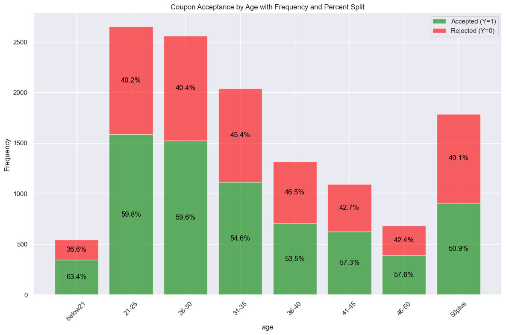

# Summary Report on Coupon Acceptance

This document represents an abbreviated summary of our findings. The full, detailed analysis, enriched with extensive visualizations and reporting, can be found in our comprehensive notebooks: [`DriverCouponAnalysis_1.ipynb`](../notebooks/DriverCouponAnalysis_1.ipynb) and [`DriverCouponAnalysis_2.ipynb`](../notebooks/DriverCouponAnalysis_2.ipynb).

## 1. Forward to Coupon Acceptance Analysis

### Methodology Overview
Our primary objective is to unravel the acceptance patterns of various drivers concerning different coupon types. This analysis necessitates a nuanced approach, considering the discrete nature of our dataset's attributes and the distinct values each attribute possesses.

### Discrete Data and Visualization Strategy
From our value count analysis, it was discerned that each attribute in our dataset is discrete, with fewer than 25 distinct values. This discovery shapes our analytical strategy, guiding us towards leveraging a series of bar graphs. These graphs will not just be simple representations; they will be methodically plotted by column or combinations of columns (group by) and filtered to spotlight the specific data we desire.

### 'BarPlotter' Module, Utility Functions for Bar Graphs
To facilitate our visualization approach, we have developed a set of utility functions, encapsulated within [`BarPlotter`](../notebooks/BarPlotter.ipynb), for crafting bar graphs. These functions, which include `create_stacked_bar_plot`, `create_stacked_bar_plot_multi`, `create_overall_stacked_bar_plot`, `create_stacked_bar_plot_with_filters`, and `create_subplot_grid`, are pivotal in streamlining the process of generating these visualizations, ensuring consistency and efficiency in our analysis. The utility functions are engineered to offer flexibility and adaptability, allowing us to efficiently analyze different facets of our data.

A key feature of these functions is their ability to create stacked bar graphs that juxtapose both frequency and acceptance rates. This visualization technique is particularly effective as it presents a comprehensive view of the data – showing not only how many times a coupon was offered (frequency) but also the proportion of those offers that were accepted (acceptance rate). This dual representation in a single graph provides a clear and insightful visualization, making it easier to discern patterns and trends that might be obscured in other forms of data representation.
  

    <table>
    <tr>
        <td style="text-align: center;">
            
            <em>Figure: BarPlotter generated plot showing both frequency and acceptance</em>
        </td>
    </tr>
</table>

### The Importance of Context in Analyzing Acceptance Rates

Understanding the context behind acceptance rates is a critical component of our analysis. Without proper context, acceptance rates can be misleading. For example, as illustrated in the previous figure, drivers below the age of 21 exhibit the highest acceptance rate at 63.4%. However, this group also represents the smallest frequency distribution, with just over 500 occurrences. This highlights a significant opportunity for the business: considering the high acceptance rate, offering more coupons to younger drivers could potentially yield better engagement and results.

Therefore, it is essential to consider not only the acceptance rate but also the frequency count — that is, the total number of coupon offers presented to each demographic group. This dual consideration enables a more comprehensive and accurate understanding of the data. By doing so, we not only interpret acceptance rates in light of their corresponding frequencies but also derive actionable insights for business strategies, such as targeting specific demographic groups with higher coupon offers based on their acceptance propensity.

### Focusing on Coupon Types

One attribute that stands out in its importance is the coupon type. Preliminary observations suggest that different coupon types, such as bar coupons or restaurant coupons, may appeal to distinctly different demographics. Hence, our analysis will delve into each coupon type individually. This focused approach will enable us to uncover specific patterns and preferences unique to each coupon category, offering targeted insights into driver behavior and preferences.

# 2. Comprehensive Final Report on Bar Coupon Acceptance

## Executive Summary

This report presents an extensive analysis of Bar coupon acceptance, focusing on driver characteristics and behaviors. It covers demographics, social settings, external factors, and occupation-related insights, offering a detailed view of key trends and strategies for effectively targeting bar coupon campaigns.

## Detailed Analysis and Insights

### 2.1 Overall Acceptance Rate Analysis
- **Findings**: Bar coupons showed a lower acceptance rate compared to the general coupon dataset.
- **Specifics**: Of the 2,017 bar coupons offered, 827 were accepted, resulting in an approximate 41% acceptance rate.

### 2.2 Acceptance Analysis by Bar Visit Frequency
- **Key Observations**: A significant divide in acceptance rates between bar goers and non-bar goers, highlighting the dominance of bar visit frequency as a predictor for coupon acceptance.
- **Statistics**:
  - **Bar Goers (Visits >0 times a month)**: Higher acceptance rate of 56.9%, indicating strong relevance of the offer to this group.
  - **Non-Bar Goers (Visits = 0 times a month)**: Lower acceptance rate of 19.3%, suggesting less interest or relevance of the offer.

### 2.3 Acceptance by Demographic Factors
- **Insights**: Demographic factors like age, gender, marital status, and parental status influenced coupon acceptance.
- **Data Highlights**:
  - **Youth Engagement**: Higher acceptance among drivers aged 21-30.
  - **Gender and Parental Status**: Males and non-parents showed a higher propensity to accept coupons.
  - **Marital Status**: Single drivers were more likely to accept coupons.

### 2.4 Social Behavior's Impact on Acceptance
- **Observations**: Drivers in social settings, such as traveling with friends or on their way home, exhibited a higher likelihood of accepting bar coupons, demonstrating the strong link between social activities and coupon redemption.

### 2.5 Acceptance by Environmental and Temporal Factors
- **Findings**: External factors like weather conditions and time of day significantly impacted coupon acceptance.
- **Details**:
  - **Weather Impact**: Better acceptance during favorable weather.
  - **Time Influence**: Higher acceptance rates during evening hours.

### 2.6 Acceptance by Occupation and Insights from Occupation Analysis
- **Insights**: Occupation, especially non-farming, fishing, or forestry, showed varied impacts on coupon acceptance.
- **Lesson Learned**: High acceptance rates in specific occupations (like farming) were misleading due to minimal offer frequency, emphasizing the need for careful analysis of frequency distribution.
- **Statistics**:
  - **Non-Farming Occupations**: Generally higher acceptance rates.

### 2.7 Detailed Findings Table

| Section | Coupon Group | Key Findings | Highest Acceptance Rate Groups | Notable Gaps | Count | Acceptance Rate |
|---------|--------------|--------------|--------------------------------|--------------|-------|-----------------|
|  Overall Bar Coupon Acceptance Rate | Bar Coupons | Lower acceptance rate compared to total coupons. | N/A | Low frequency of bar coupon offers. | 2017 | 41.00% |
|  Acceptance by Bar Visit Frequency | Bar Coupons | Disparity based on bar visit frequency. | 4-8 times/mo: 78.00%, >8 times/mo: 73.47% | Frequent visitors less targeted. | Varies | Varies |
|  Acceptance by Demographic Factors | Bar Coupons | Higher acceptance among specific age groups. | Over 25: 69.52%, 21-25: 68.67% | Lower acceptance in 'Others' category. | Varies | Varies |
|  False Flag in Occupation Analysis | Bar Coupons | Identified false flag in occupation-focused analysis. | Non Farmer, No Kids: 71.32% | Overemphasis on farming occupation proved misleading. | Non Farmer, No Kids: 551, All Farmers: 9 | Non Farmer, No Kids: 71.32%, All Farmers: 44.44% |
|  Acceptance by Lifestyle and Demographics | Bar Coupons | Different acceptance rates based on lifestyle and demographic factors. | Group 2: Bars >1/month, Age <30 (72.17%) | Lower acceptance for Group 3: Cheap Restaurants >4/month, Income <50K. | Group 1: 551, Group 2: 345, Group 3: 246 | Group 1: 71.32%, Group 2: 72.17%, Group 3: 43.90% |
|  Acceptance by Various Factors | Bar Coupons | Varied acceptance rates based on factors like destination, weather, and time. | Friend(s) Passenger: 71.15%, Sunny Weather: 61.10% | Lowest for Kid(s) Passenger: 29.41%, Widowed Marital Status: 0.00% | Varies | Varies |

### 2.8 Conclusion and Strategic Recommendations

Based on the observations from Section 8, our hypotheses about drivers who are more likely to accept bar coupons are as follows:

- **Frequent Bar Visitors**: 
  - Drivers who regularly visit bars, especially those visiting more than once a month, are significantly more likely to accept bar coupons. 
  - **Recommendation**: Target marketing efforts towards frequent bar goers.

- **Social Behavior Influence**: 
  - A higher coupon acceptance rate is observed among drivers in social settings, such as those traveling with friends or on their way home.
  - **Recommendation**: Focus on targeting drivers in social settings to enhance coupon acceptance.

- **Demographic Factors**: 
  - Younger drivers (21-30 age group) and single individuals show higher acceptance rates. Gender and parental status also play roles, with males and non-parents being more receptive.
  - **Recommendation**: Tailor promotional strategies considering age, gender, marital, and parental status.

- **Environmental and Temporal Factors**: 
  - Coupon acceptance is positively influenced by favorable weather conditions and peak social hours like evenings.
  - **Recommendation**: Align offers with favorable environmental conditions and optimal times.

---

# 3. Comprehensive Final Report on Coffee House Coupon Acceptance

## Executive Summary

This report presents an extensive analysis of Coffee House coupon acceptance, focusing on passenger characteristics. It covers various aspects such as demographics, timing, and situational factors, providing a holistic view of key trends and strategic marketing opportunities.

## Detailed Analysis and Insights

### 3.1 Overall Acceptance Rate Analysis
- **Findings**: Compared to the overall coupon dataset, Coffee House coupons had a lower acceptance rate.
- **Specifics**: Out of 3,996 Coffee House coupons offered, 1,995 were accepted (approx. 49.92% acceptance rate).

### 3.2 Preliminary Holistic Analysis
- **Key Observations**: Acceptance rates varied based on factors like destination, time, and weather. 
- **Statistics**:
  - **Weather Impact**: Sunny weather had a 61.1% acceptance rate.
  - **Time Influence**: Coupons offered at 10 AM observed over 60% acceptance.

### 3.3 Acceptance by Passenger Type
- **Insights**: Higher acceptance rates were noted when passengers traveled with friends or partners compared to traveling alone.
- **Data Highlights**:
  - **Traveling with Friends**: High acceptance but lower offer distribution.
  - **Solo Travelers**: Notably lower acceptance rate.

### 3.4 Acceptance by Time
- **Observations**: Certain times, like 2 PM for solo travelers, had no offers, suggesting missed opportunities.
- **Details**:
  - **Evening Opportunities**: 'Traveling with Friends' at 10 PM showed a 68.27% acceptance rate but only 104 offers.

### 3.5 Acceptance by Destination
- **Findings**: 'No Urgent Place' was a highly effective destination across passenger types.
- **Statistics**:
  - **Effective Destination**: 'Traveling with Friends' to 'No Urgent Place' had a 59.69% acceptance rate with 1,228 offers.

### 3.6 Acceptance by Age
- **Trends**: Younger passengers, particularly in groups, showed higher acceptance rates.
- **Key Numbers**:
  - **Youth Engagement**: 'Below 21' age group with friends had an 85.37% acceptance rate but only 41 offers.

### 3.7 Acceptance by Income
- **Insights**: Higher acceptance rates in lower income brackets were observed across passenger categories.
- **Detailed Stats**:
  - **Income Sensitivity**: 'Less than $12500' bracket with friends showed a 75.28% acceptance rate with 89 offers.

### 3.8 Detailed Findings Table

| Section | Coupon Group | Key Findings | Highest Acceptance Rate Groups | Notable Gaps or Opportunities |
| ------- | ------------ | ------------ | ------------------------------ | ----------------------------- |
| Overall Coffee House Coupon Acceptance Rate | Coffee House | Lower overall acceptance rate compared to total coupons. | N/A | N/A |
| Preliminary Holistic Analysis | Coffee House | Varied acceptance based on multiple factors. | Sunny weather; 10 AM offers. | N/A |
| Acceptance by Passenger Type | Coffee House | Higher rates when traveling with friends or partners; lower for solo travelers. | 'Traveling with Friends': high acceptance, lower distribution. | Solo travelers: lower acceptance rate. |
| Acceptance by Time | Coffee House | Gaps in offers at specific times. | 'Traveling with Friends' at 10 PM: 68.27% acceptance, low offer count. | 'Traveling Alone' at 2 PM: zero offers. |
| Acceptance by Destination | Coffee House | 'No Urgent Place' highly accepted across passenger types. | 'Traveling with Friends' to 'No Urgent Place': 59.69% acceptance. | Limited data for other destinations. |
| Acceptance by Age | Coffee House | Younger age groups, especially in groups, show higher acceptance. | 'Below 21' with friends: 85.37% acceptance, low offer count. | Older age groups: varied acceptance. |
| cceptance by Income | Coffee House | Higher acceptance in lower income brackets. | 'Less than $12500' with friends: 75.28% acceptance, moderate offers. | Solo travelers: lower acceptance across incomes. |

### 3.9. Conclusions and Strategic Recommendations

- **Enhanced Timing and Targeting**: Addressing time-specific gaps, like the absence of offers for solo travelers at 2 PM, can lead to increased acceptance.
- **Focus on High Acceptance, Low Distribution Groups**: There's significant potential in increasing offers to groups with high acceptance rates but low distribution, particularly younger passengers and those in lower income brackets.
- **Personalization for Solo Travelers**: More compelling and personalized offers for solo travelers could improve engagement.
- **Utilizing 'No Urgent Place' as a Key Target**: High acceptance rates for this destination suggest potential as a primary target for promotions.
- **Expanding Data Collection**: Further research into underrepresented destinations and age groups can provide deeper insights for targeted marketing.

Aligning marketing strategies with these nuanced insights can optimize coupon acceptance rates and engagement across various passenger demographics, maximizing Coffee House's promotional campaign effectiveness.